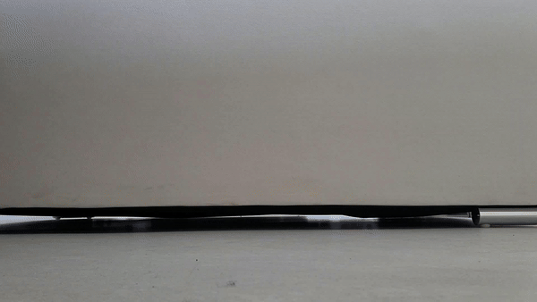

# CUDA Accelerated Object Detection (WIP)

## About

The aim of this project is to implement an object detection pipeline in C++ and CUDA, using image processing concepts, such as Gaussian convolutions, mathematical morphology and connected component labeling. It is a work in progress, with the CUDA implementation currently underway.



## Benchmarks

Here are the benchmarks on individual that I have obtained with my CPU vs GPU implementation. The tests were conducted on an NVIDIA GeForce GTX 1650, with 4GB of VRAM. The synthetic images are of size 1920x1080, and the pipeline parameters can be found in `config.json`.

|            | CPU Time | GPU Time | Speed gain  |
|------------|----------|----------|-------------|
|Grayscale   | 1.650 ms | 0.088 ms | x18.75      |
|Difference  | 0.213 ms | 0.079 ms | x2.69       |
|Gaussian    | 854 ms   | 34 ms    | x25.11      |
|Morphology  | 5680 ms  | 130 ms   | x43.69      |
|Binary      | 1.150 ms | 0.080 ms | x14.37      |
|Components  | 1.690 ms |          |             |
|Bounding box| 1.290 ms |          |             |
|            |          |          |             |
| ***Total Time*** | ***6539.9 ms***|          |             |

Below are the full benchmark details.
### CPU

```bash
------------------------------------------------------------------
Benchmark                        Time             CPU   Iterations
------------------------------------------------------------------
BM_Grayscale/real_time        1.65 ms         1.63 ms          424
BM_Difference/real_time      0.213 ms        0.210 ms         3002
BM_Gaussian/real_time          854 ms          850 ms            1
BM_Morphology/real_time       5680 ms         5680 ms            1
BM_Binary/real_time           1.15 ms         1.15 ms          609
BM_Components/real_time       1.69 ms         1.69 ms          331
BM_BBox/real_time             1.29 ms         1.29 ms          539

TOTAL_TIME                  6539.9 ms       6535.9 ms
```

### GPU

```bash
------------------------------------------------------------------
Benchmark                        Time             CPU   Iterations
------------------------------------------------------------------
BM_Grayscale/real_time       0.088 ms        0.088 ms        10000
BM_Difference/real_time      0.079 ms        0.079 ms        10000
BM_Gaussian/real_time         34.0 ms         34.0 ms        10000
BM_Morphology/real_time        130 ms          130 ms        10000
BM_Binary/real_time          0.080 ms        0.080 ms        10000
# BM_Components/real_time    TODO
# BM_BBox/real_time          TODO

TOTAL_TIME                  164.27 ms       164.27 ms
```

## Getting started

This project uses [nlohmann JSON](https://github.com/nlohmann/json), and is included via git submodule. To clone my project with the correct submodules, run the following commands:

```bash
$ git clone --recurse-submodules git@github.com:sudomane/cv-gpu-object-detection.git
```

Or alternatively,

```bash
$ git clone git@github.com:sudomane/cv-gpu-object-detection.git
$ cd cv-gpu-object-detection
$ git submodule init   # Create submodule configuration file
$ git submodule update # Fetch submodule data
```

## Setting up the Python Environment

A Python environment will be necessary to run the render script to generate a video from the bounding box results from the object detection pipeline.
To create the python environment:

```bash
$ python -m venv env
$ source env/bin/activate
$ pip install -r requirements.txt
```

## Building C++ code

This project requires OpenCV and CUDA, and must be installed on your system to build the source code. To build the source code:

```bash
$ mkdir build
$ cd build
$ cmake .. -DCMAKE_BUILD_TYPE=Release
$ make main
```

## Running the code

To execute the program, from within the build folder:

```bash
$ ./main --mode=[GPU,CPU] --config=CONFIG_PATH
```

Once completed, a JSON file containing the bounding box coordinates for each frame will be outputted in the build directory, with the file name: `bbox.json`.

To render a video of the frames, with the bounding box coordinates, run the `render.py` script found at the root of this project.

```bash
$ python3 render.py --output_filename FILENAME --json_path PATH --fps FPS
```

## Running benchmarks

Within your build folder, run the following commands:

```bash
$ make bench     # CPU Benchmarks
$ make bench_gpu # GPU Benchmarks
```

To execute the benchmarks, from within the build folder:

```bash
$ ./benchmark/bench     # CPU Benchmarks
$ ./benchmark/bench_gpu # GPU Benchmarks
```
